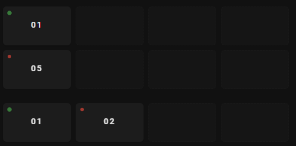

# [HACS] NAS Visualization Card

Home Assistant Lovelace custom card to visualize NAS drives in a TrueNAS-inspired grid.

Installation with HACS:

1. In HACS, add this repository as a custom repository with category `Dashboard`.
2. Download `NAS Drive Visualization Card` from HACS.

Installation (manual):

1. Build the project: `npm install` then `npm run build`.
2. Add the produced `dist/nas-drive-card.js` as a Lovelace resource (type: module).

Example configuration:

```yaml
type: custom:nas-drive-card
rows: 2
columns: 4
drives:
  - entity: sensor.disk01_status
  - entity: sensor.disk02_status
    index: 5
```

This project is intended to be published to HACS. See `hacs.json` for metadata.

